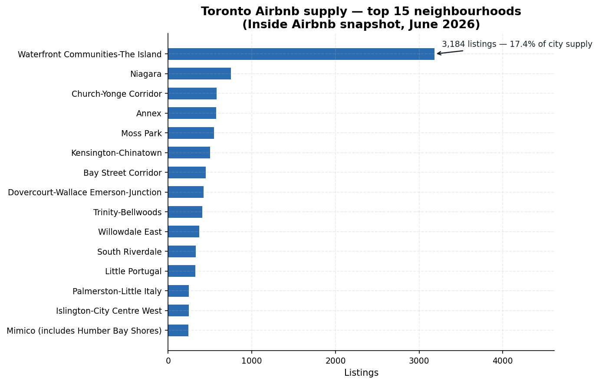
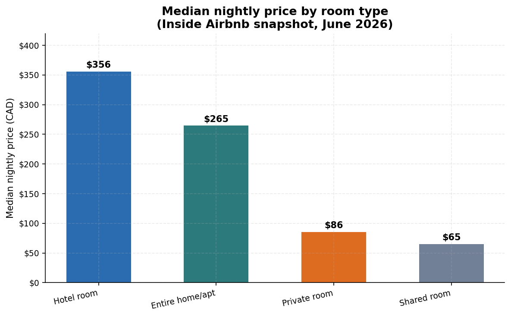
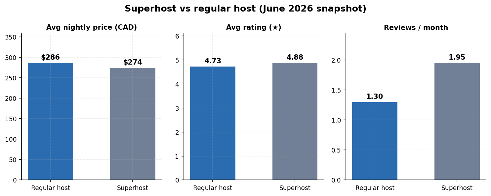
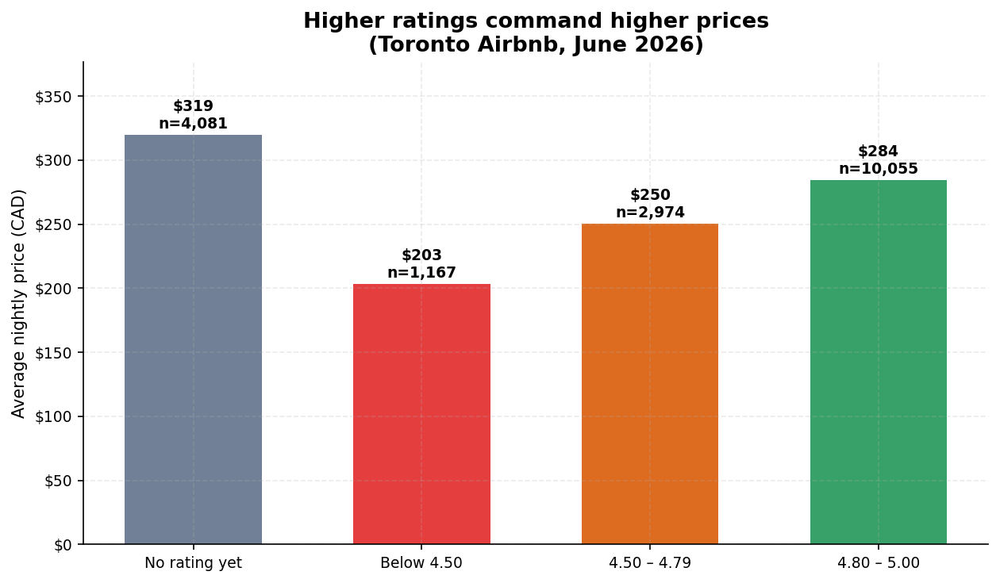
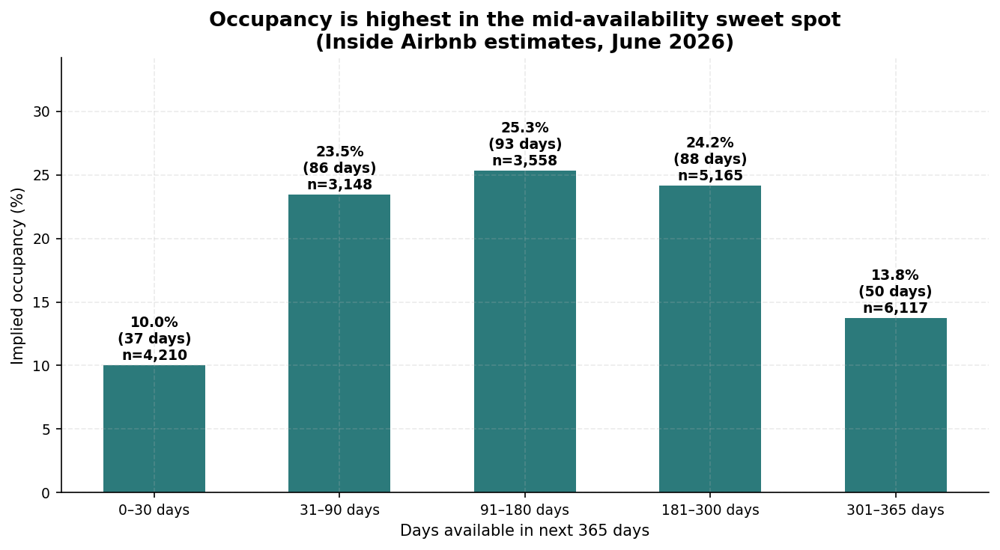
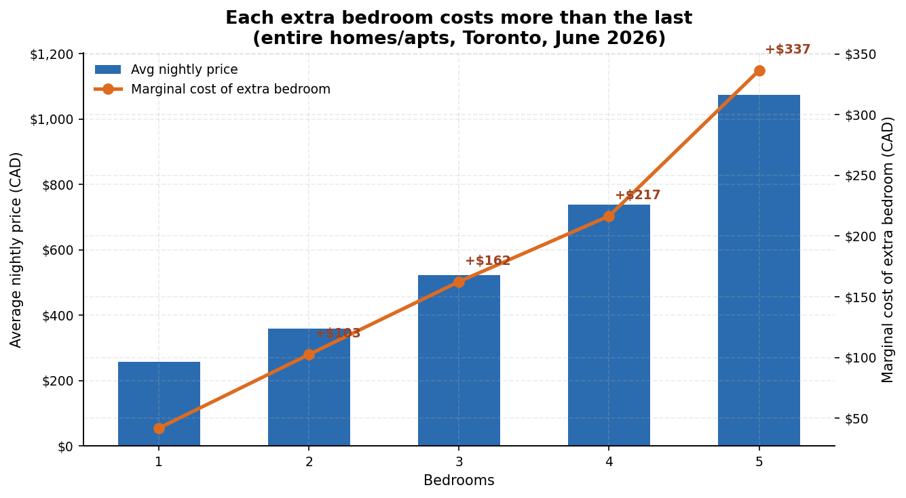

# Toronto Airbnb Listings — SQL Analysis

An end-to-end SQL data analysis of Toronto's short-term rental market: ingest a
real public dataset, profile its quality, then answer business questions with
clean, portfolio-ready SQL.

## Dataset

- **Source:** [Inside Airbnb](https://insideairbnb.com/get-the-data/) — detailed
  listings file, Toronto, Ontario, Canada
- **Snapshot:** 15 June 2026 release (rows scraped 2026-06-16 → 2026-06-28)
- **File:** `data/listings.csv` (22,198 listings × 90 columns, decompressed from
  `listings.csv.gz`)
- **License:** [CC BY 4.0](https://creativecommons.org/licenses/by/4.0/)
- **Grain:** one row per Airbnb listing at scrape time (prices in CAD)

## Project structure

```
airbnb-toronto-sql-analysis/
├── data/
│   ├── listings.csv               # June source data (downloaded, gitignored)
│   ├── listings-2026-07.csv       # July source data (downloaded, gitignored)
│   ├── listings-2026-08.csv       # August source data (downloaded, gitignored)
│   ├── listings-2026-09.csv       # September source data (downloaded, gitignored)
│   ├── calendar-2026-08.csv     # August calendar data (downloaded, gitignored)
│   ├── reviews-2026-08.csv      # August reviews data (downloaded, gitignored; cut to 2023+ in db)
│   ├── airbnb_toronto.db          # June SQLite database (build artifact)
│   ├── airbnb_toronto_2026_07.db  # July SQLite database (build artifact)
│   ├── airbnb_toronto_2026_08.db  # August SQLite database (build artifact)
│   └── airbnb_toronto_2026_09.db  # September SQLite database (build artifact)
├── sql/
│   ├── 01_setup.sql        # staging import → cleaned, typed `listings` table (June)
│   ├── 01_setup-2026-07.sql # same pipeline, July CSV (June script untouched)
│   ├── 01_setup-2026-08.sql # same pipeline, August CSV (June script untouched)
│   ├── 01_setup-2026-09.sql # same pipeline, September CSV (June script untouched)
│   ├── 02_exploration.sql  # data-quality & exploratory checks (Q0–Q8)
│   ├── 03_analysis.sql     # 11 business questions (A1–A11)
│   ├── 04_calendar_analysis.sql  # real occupancy from calendar.csv (C1–C6, August)
│   └── 05_reviews_analysis.sql   # review volume/velocity/text trends (R1–R6, August)
├── scripts/
│   ├── make_charts.py      # generates docs/charts from the June db (matplotlib)
│   └── make_charts_month.py # parameterized variant: --db --outdir --label
├── docs/
│   ├── findings.md             # June findings report (filled)
│   ├── findings-2026-07.md     # July findings report (filled)
│   ├── findings-2026-08.md     # August findings report (filled)
│   ├── findings-2026-09.md     # September findings report (filled)
│   ├── query_output.txt        # June: actual output of sql/03_analysis.sql
│   ├── query_output-2026-07.txt # July: actual analysis output
│   ├── query_output-2026-08.txt # August: actual analysis output
│   ├── query_output-2026-09.txt # September: actual analysis output
│   ├── query_output-04-calendar.txt # August: calendar occupancy queries
│   ├── query_output-05-reviews.txt  # August: review-trend queries
│   └── charts/                 # June figures + charts/2026-07/, 2026-08/, 2026-09/
└── README.md
```

## How to run

Requires `sqlite3` (3.35+). Run from the project root:

```bash
# 1. Build the database (imports CSV, creates cleaned `listings` table)
sqlite3 data/airbnb_toronto.db < sql/01_setup.sql

# 2. Run data-quality checks
sqlite3 data/airbnb_toronto.db < sql/02_exploration.sql

# 3. Run the business-question analysis
sqlite3 data/airbnb_toronto.db < sql/03_analysis.sql
```

To re-download the data:

```bash
curl -sSL -o data/listings.csv.gz \
  "https://data.insideairbnb.com/canada/on/toronto/2026-06-15/data/listings.csv.gz"
gunzip -c data/listings.csv.gz > data/listings.csv
```

## Data-quality summary (verified)

| Check | Result |
|---|---|
| Listings loaded | 22,198 |
| Duplicate listing ids | 0 |
| Missing nightly price | 3,921 (17.7% — no active quote at scrape) |
| Missing room type / neighbourhood / coordinates | 0 |
| Listings never reviewed | 5,053 (22.8%) |
| Review dates after scrape / last < first review | 0 |
| Fully blank `instant_bookable` column (dropped from clean table) | 22,198 / 22,198 |

## Business questions

| # | Question | Techniques |
|---|---|---|
| A1 | Top 15 neighbourhoods by supply, price, market share | CTE, window `SUM() OVER ()` |
| A2 | Entire-home premium over private rooms | Median via `ROW_NUMBER()` |
| A3 | Superhost vs regular-host price/rating/review gaps | `GROUP BY`, conditional agg |
| A4 | Rating bands vs average price | `CASE` bucketing |
| A5 | Availability bands vs estimated occupancy | Bucketing, derived metrics |
| A6 | 20 most-reviewed listings | `ORDER BY … LIMIT` |
| A7 | Seasonality of latest reviews (last 24 months) | `STRFTIME`, time series |
| A8 | Host concentration: share of supply by portfolio size | CTE + self-join |
| A9 | Marginal price of each extra bedroom | `LAG()` window function |
| A10 | Top 10 neighbourhoods by estimated annual revenue | Aggregation, `HAVING` |
| A11 | Best-value picks: 4.8★+ entire homes below neighbourhood median | CTE, windowed median, join |

## Monthly snapshots

The same 20-query pipeline was re-run on three newer Inside Airbnb snapshots —
schemas verified identical (90 columns, same header order), so the analysis
queries ran unchanged:

| Snapshot | Release | Scrape window | Listings | Findings report |
|----------|---------|---------------|----------|-----------------|
| June 2026 | 2026-06-15 | 2026-06-16 → 2026-06-28 | 22,198 | [findings.md](docs/findings.md) |
| July 2026 | 2026-07-14 | 2026-07-14 → 2026-07-16 | 22,212 | [findings-2026-07.md](docs/findings-2026-07.md) |
| August 2026 | 2026-08-15 | 2026-08-15 → 2026-08-27 | 22,257 | [findings-2026-08.md](docs/findings-2026-08.md) |
| September 2026 | 2026-09-16 | 2026-09-17 → 2026-09-18 | 22,050 | [findings-2026-09.md](docs/findings-2026-09.md) |

Biggest month-over-month shifts: the June→July superhost price reversal
(superhosts went from pricing *below* regular hosts to *above*, and stayed
there through September); the entire-home median sliding $265 → $254 →
$230 across the four months; and the no-price-quote share rising from
17.7% (June) to 24.0% (September).

## Calendar & reviews (August 2026)

The August database goes beyond the listings snapshot: `calendar.csv.gz`
(8,123,819 rows — every listing × 365 forward days) and `reviews.csv.gz`
(709,449 rows, db keeps 2023+ = 447,129) were imported as typed `calendar`
and `reviews` tables. New queries: `sql/04_calendar_analysis.sql`
(true occupancy, estimate-bias check, seasonal availability curve, lead
time, min-nights) and `sql/05_reviews_analysis.sql` (36-month volume
trend, review length, velocity leaders, naive text signal). Results are in
sections 6–7 of the
[August findings report](docs/findings-2026-08.md).

Headline: true forward occupancy averages **47.8%**, running ~2.4× above
Inside Airbnb's backward estimate (~20%); review volume peaked at 24,685
reviews (Jul 2026); 56% of listings require 8–30-night minimum stays.

## Key findings (June 2026 snapshot)

- **Entire-home premium: 3.1×** — median $265/night for an entire home vs
  $85.50 for a private room. Waterfront Communities-The Island dominates
  supply with 3,184 listings (17.4% of the city); Kensington-Chinatown is
  the bargain corner at a $145 median.

  
  

- **Superhosts win on value, not price** — superhosts charge *less* than
  regular hosts on average ($273.80 vs $286.37) while rating 4.88 vs 4.73
  and earning ~3× the reviews (1.95 vs 1.30 reviews/month).

  

- **Ratings pay** — average price rises with rating band ($203 below 4.50 →
  $284 at 4.80–5.00). Unrated listings price highest ($319), likely new
  hosts pricing ambitiously before reviews arrive.

  

- **Availability sweet spot** — estimated occupancy peaks (~25%) for
  listings available 91–180 days/yr; listings bookable 301+ days sit at
  13.8%, suggesting a long tail of stale supply.

  

- **Bedroom economics** — the marginal nightly cost of an extra bedroom
  climbs from +$103 (1→2 beds) to +$337 (4→5 beds), via `LAG()` over
  grouped averages.

  

- **Host concentration** — 53.1% of priced supply sits with single-listing
  hosts (avg $344.96/night) vs 16.8% with 6+ listing operators (avg
  $211.42): casual hosts price high, professionals compete on volume.

Full analysis: [`docs/findings.md`](docs/findings.md).

## Sample query output

A9 — marginal cost per bedroom (entire homes):

```
bedrooms  listings  avg_price  marginal_cost_of_extra_bedroom
--------  --------  ---------  ------------------------------
1         5720      256.57
2         3865      359.07     102.5
3         1499      521.57     162.49
4         450       738.11     216.54
5         167       1074.63    336.52
```

Complete output of all 11 analysis queries:
[`docs/query_output.txt`](docs/query_output.txt).

## Limitations & next steps

See [`docs/findings.md`](docs/findings.md) for the full write-up, including
limitations (single snapshot, estimated occupancy/revenue fields are Inside
Airbnb's models, not Airbnb's books) and ideas for extension
(multi-snapshot trends, calendar.csv occupancy analysis, reviews.csv sentiment).

> **Note:** `data/` (CSVs + built SQLite dbs, ~476 MB) is gitignored. Clone,
> then re-download the data and run e.g. `sql/01_setup-2026-08.sql` to
> rebuild a month's database.

## Interactive dashboard

A Streamlit dashboard over all four monthly snapshots (June → September 2026)
lives in [`dashboard/`](dashboard/): KPI cards and month-over-month trends,
neighbourhoods, hosts, pricing, true (calendar-derived) occupancy and reviews
for August, plus an interactive value-finder built on the A11 query.

```bash
cd dashboard
./.venv/bin/streamlit run app.py
```

See [`dashboard/README.md`](dashboard/README.md) for the tab-by-tab tour.
