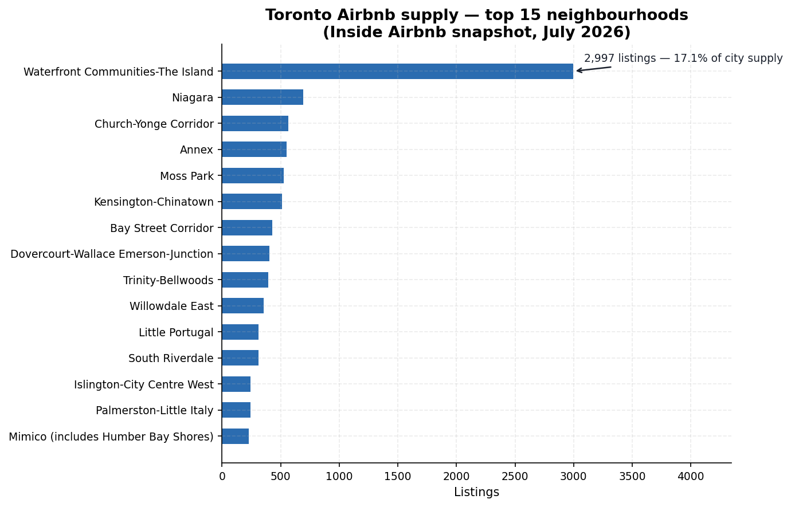
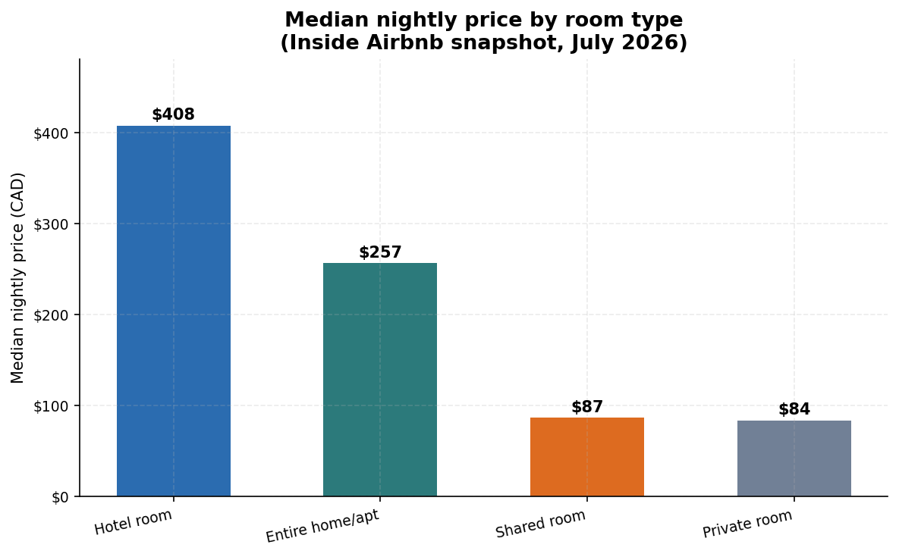
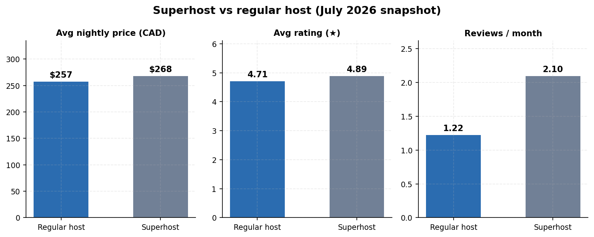
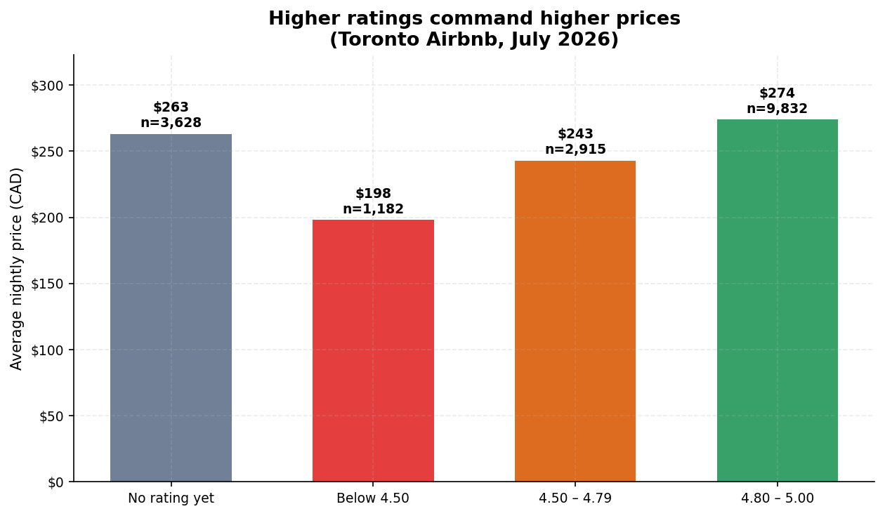
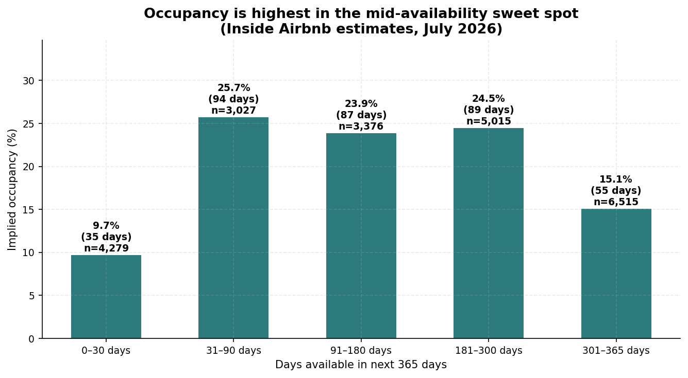
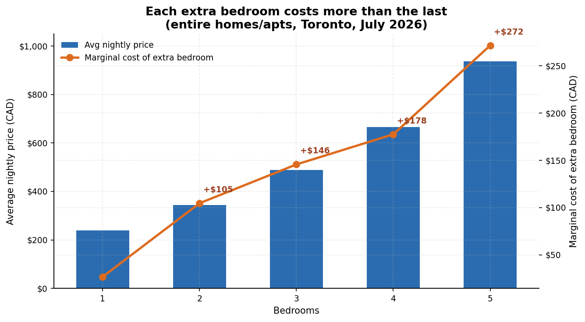

# Findings Report — Toronto Airbnb Listings (July 2026 snapshot)

> Figures verified from `sql/02_exploration.sql` and `sql/03_analysis.sql`
> output against `data/airbnb_toronto_2026_07.db`, 2026-09-23. No fabricated
> numbers.

## 1. Executive summary

22,212 Toronto Airbnb listings (snapshot 2026-07-14; rows scraped
2026-07-14 → 2026-07-16) were cleaned and analysed with the same 20-query
pipeline as the June report. Three takeaways stand out:

1. **The superhost story flipped:** superhosts now charge *more* than
   regular hosts ($267.80 vs $256.94/night) while still rating 4.89 vs 4.71
   and earning ~2.9× the reviews — the opposite of June, when superhosts
   priced *below* regular hosts. The value-premium narrative is
   snapshot-sensitive.
2. **Entire-home prices are softening:** the median entire home fell to
   $256.91 (from $265 in June), narrowing the entire-home premium to 3.06×
   over private rooms ($84.00).
3. **The missing-price share jumped:** 21.0% of listings now have no active
   price quote (up from 17.7%), shrinking the priced population to 17,557
   listings.

> ### vs June snapshot — the biggest month-over-month changes
> - **Superhost price reversal:** June superhosts were cheaper than regular
>   hosts ($273.80 vs $286.37); July superhosts are pricier ($267.80 vs
>   $256.94).
> - **No-quote share up:** listings without a price quote rose 17.7% →
>   21.0% (4,655 listings).
> - **Entire-home median down 3%:** $265 → $256.91; private-room median
>   $85.50 → $84.00; premium ratio 3.10 → 3.06.
> - **Never-reviewed share down:** 22.8% → 21.7% (4,830 listings).
>
> Beyond these, the market looks structurally stable: listing count barely
> moved (22,198 → 22,212) and the host-concentration split is nearly
> identical.

> Verified data profile:
> - Listings analysed: 22,212 (all ids unique — 0 duplicates)
> - Scrape window: 2026-07-14 → 2026-07-16
> - Room-type mix: 68.3% entire home/apt, 31.3% private room, 0.3% hotel room, 0.1% shared room
> - 21.0% of listings have no active price quote; 21.7% (4,830) were never reviewed

## 2. Method

- **Source:** Inside Airbnb detailed listings, Toronto, snapshot 2026-07-14
  (rows scraped 2026-07-14 → 2026-07-16). One row per listing; prices in CAD.
- **Pipeline:** `sql/01_setup-2026-07.sql` (generated from the June setup
  script with the new CSV path; June pipeline left intact) loads the CSV
  into a raw staging table (all TEXT), then builds the same cleaned, typed
  `listings` table: `$1,234.56` → numeric price, `'t'/'f'` → 1/0 flags,
  date casts, `bathrooms_text` → numeric baths. `instant_bookable` is again
  fully blank (22,212/22,212 rows) and dropped.
- **Quality gates:** `sql/02_exploration.sql` run unchanged against the new
  db. Result: 0 duplicate ids; 21.0% of listings have no price quote
  (excluded from price math); 21.7% never reviewed; no negative prices, bad
  ratings, or impossible dates found.
- **Analysis:** `sql/03_analysis.sql` run unchanged (11 questions; same
  CTEs, window functions, self-join). Schema verified identical to June
  (90 columns, same header order) — no query adaptations needed.

## 3. Findings

### 3.1 Where is the supply? (A1)

Top 5 neighbourhoods by listing count: Waterfront Communities-The Island
(2,997 listings, 17.1% of city supply, median $323), Niagara (692, 3.9%,
$303), Church-Yonge Corridor (564, 3.2%, $248), Annex (550, 3.1%, $267),
Moss Park (527, 3.0%, $274). At the bargain end, Kensington-Chinatown's
median is just $135 — less than half the Waterfront median. The luxury skew
persists: Trinity-Bellwoods averages $288 but its median is only $175.



### 3.2 The entire-home premium (A2)

Median entire home/apt: **$256.91/night**. Median private room: **$84.00**.
Premium ratio: **3.06×**. The ratio has narrowed slightly from June's
3.10×.



### 3.3 Superhost economics (A3)

| Host type    | Listings | Avg price | Avg rating | Reviews/month | Avg total reviews |
|--------------|----------|-----------|------------|---------------|-------------------|
| Superhost    | 7,288    | $267.80   | 4.89       | 2.10          | 55.4              |
| Regular host | 10,268   | $256.94   | 4.71       | 1.22          | 19.2              |
| Unknown      | 1        | $440.10   | 5.00       | 1.00          | 1.0               |

Unlike June — when superhosts priced *below* regular hosts — superhosts now
charge ~4% more on average, while still rating higher (4.89 vs 4.71) and
earning ~2.9× the reviews. Analytical caveat: correlation, not causation,
and the June/July flip shows this gap is sensitive to snapshot composition
(e.g. which listings have active quotes). (One row has a blank superhost
flag, grouped as "Unknown".)



### 3.4 Ratings and price (A4)

| Rating band   | Listings | Avg price | Avg reviews |
|---------------|----------|-----------|-------------|
| 4.80 – 5.00   | 9,832    | $273.94   | 45.1        |
| No rating yet | 3,628    | $263.21   | 0.0         |
| 4.50 – 4.79   | 2,915    | $242.88   | 48.7        |
| Below 4.50    | 1,182    | $198.12   | 12.7        |

Among rated listings, price rises with rating — quality pays, as in June.
The "No rating yet" band ($263.21) sits below the top-rated band this
month, unlike June's snapshot where unrated listings were the priciest.



### 3.5 Availability and occupancy (A5)

| Availability band | Listings | Avg est. occupied days/yr | Implied occupancy |
|-------------------|----------|---------------------------|-------------------|
| 0–30 days         | 4,279    | 35.5                      | 9.7%              |
| 31–90 days        | 3,027    | 93.9                      | 25.7%             |
| 91–180 days       | 3,376    | 87.2                      | 23.9%             |
| 181–300 days      | 5,015    | 89.4                      | 24.5%             |
| 301–365 days      | 6,515    | 55.0                      | 15.1%             |

The occupancy peak shifted to the 31–90-day band (25.7%) from June's
91–180-day band (25.3%) — the mid-availability sweet spot holds. The
301+ day tail (6,515 listings) sits at 15.1% implied occupancy, again
suggesting stale supply. Note: `estimated_occupancy_l365d` is Inside
Airbnb's estimate, not observed bookings.



### 3.6 Review magnets (A6)

The same private room in Danforth East York tops the city ("Private suite
all to yourself", now 1,396 reviews, $113, 4.87★). The top-20 list remains
dominated by **private rooms** — high-turnover budget stays generate review
volume, not luxury.

### 3.7 Seasonality signal (A7)

`last_review` months: June 2026 leads (4,472 listings with their latest
review that month), followed by July 2026 (3,706) — expected, since the
July scrape only covered 2026-07-14 → 2026-07-16 while June is a full
month. May 2026 follows at 1,101. The summer peak is visible across both
the June and July scrape windows. Caveat: this measures *recency of the
latest review*, a rough activity proxy, not true demand.

### 3.8 Who owns the supply? (A8)

| Host size band | Hosts | Listings | % of supply | Avg listing price |
|----------------|-------|----------|-------------|-------------------|
| 1 listing      | 9,357 | 9,357    | 53.3%       | $323.78           |
| 2–5 listings   | 2,040 | 5,291    | 30.1%       | $198.31           |
| 6+ listings    | 238   | 2,909    | 16.6%       | $175.87           |

Computed via self-join. The structure is nearly identical to June: casual
hosts are still ~53% of priced supply and price well above multi-listing
operators — though the single-listing average fell from $345 to $324, and
the 6+ band from $211 to $176.

### 3.9 Bedroom economics (A9)

| Bedrooms | Listings | Avg price | Marginal cost of extra bedroom |
|----------|----------|-----------|-------------------------------|
| 0        | 1        | $211.67   | — (n=1, ignore)               |
| 1        | 5,496    | $238.44   | —                             |
| 2        | 3,647    | $343.06   | +$104.63                      |
| 3        | 1,430    | $488.74   | +$145.68                      |
| 4        | 435      | $666.29   | +$177.55                      |
| 5        | 151      | $937.88   | +$271.59                      |

Entire homes only. The accelerating marginal cost pattern holds (+$105 at
1→2 up to +$272 at 4→5), computed with `LAG()` over grouped averages. The
0-bedroom row (n=1) is too thin to trust.



### 3.10 Revenue leaders (A10)

Top 5 neighbourhoods by avg estimated annual revenue per listing: Black
Creek ($64,295, n=40), Waterfront Communities-The Island ($36,110,
n=2,997), Broadview North ($33,565, n=27), Niagara ($27,673, n=692),
Playter Estates-Danforth ($27,657, n=37). The same three top names as June,
in the same order; Black Creek's lead again rests on a tiny n (40) —
luxury outliers, not a broad signal. Waterfront's #2 spot on 2,997 listings
is the robust one.

### 3.11 Best-value picks (A11)

20 highly-rated (4.8★+, 20+ reviews) entire homes priced below their
neighbourhood median. Standouts: the same 5.0★ Bloorcourt studio at $91 vs
a $176 local median (177 reviews); a 5.0★ Lambton Baby Point listing at
$156 vs a $202 median (165 reviews). The query keeps working as a
realistic "consumer tool".

## 4. Limitations

- **Single snapshot:** no true time series; occupancy/revenue are modelled
  estimates from one scrape, and `price` is a quoted nightly rate, not a
  transacted price.
- **Missing prices (21.0%):** listings without an active quote are excluded
  from price math — a larger exclusion than June (17.7%), so June-vs-July
  price comparisons partly reflect composition change.
- **Review proxy:** review counts understate stays (not every guest reviews)
  and `last_review` month is an activity proxy, not demand.
- **Geography:** neighbourhood boundaries are Inside Airbnb's, not the
  city's official wards.
- **Scope:** Toronto only, July 2026 — findings don't generalise to other
  cities or months.

## 5. Next steps

- [x] Re-run on the July snapshot (this report).
- [ ] Add `calendar.csv` (365-day availability per listing) for real
      occupancy analysis instead of estimates.
- [ ] Add `reviews.csv` for review-velocity and sentiment trends over time.
- [ ] Continue the monthly series (June → July → August…) for true
      trendlines.
- [ ] Build a dashboard (Metabase / Streamlit) on top of these queries.
- [ ] Re-run monthly; automate with a scheduled `sqlite3` + script job.

## Appendix: reproducibility

```bash
sqlite3 data/airbnb_toronto_2026_07.db < sql/01_setup-2026-07.sql
sqlite3 data/airbnb_toronto_2026_07.db < sql/02_exploration.sql
sqlite3 data/airbnb_toronto_2026_07.db < sql/03_analysis.sql
```

Query outputs for every figure above are the actual run results saved at
`docs/query_output-2026-07.txt`. Regenerate with:

```bash
sqlite3 data/airbnb_toronto_2026_07.db < sql/03_analysis.sql > docs/query_output-2026-07.txt
```

Charts were regenerated for this snapshot (same 6 figures, July labels):

```bash
python3 scripts/make_charts_month.py --db data/airbnb_toronto_2026_07.db \
    --outdir docs/charts/2026-07 --label "July 2026"
```
