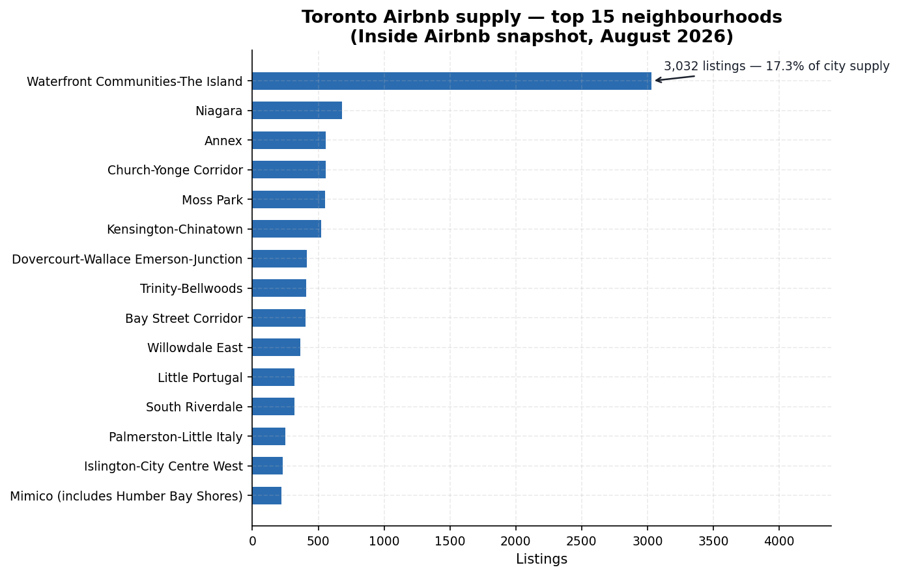
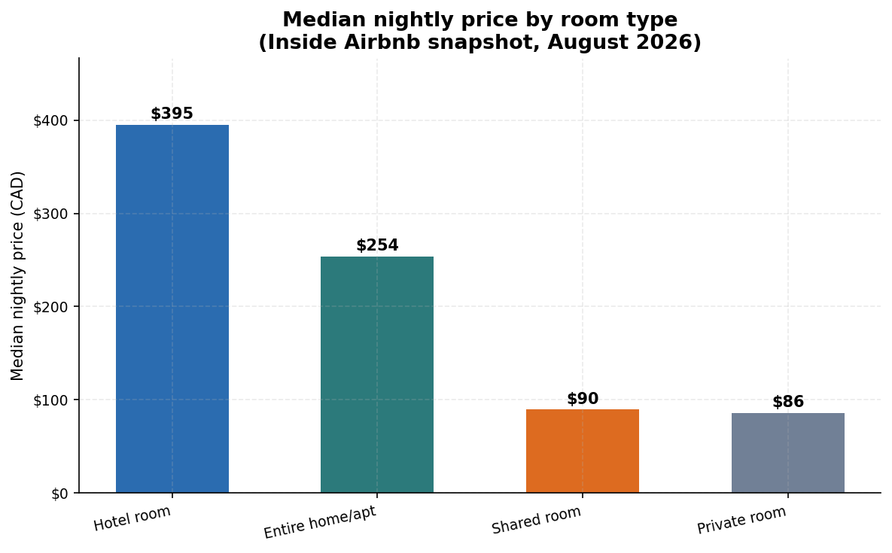
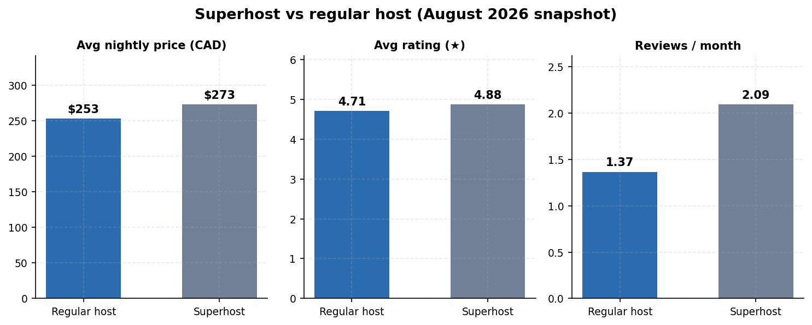
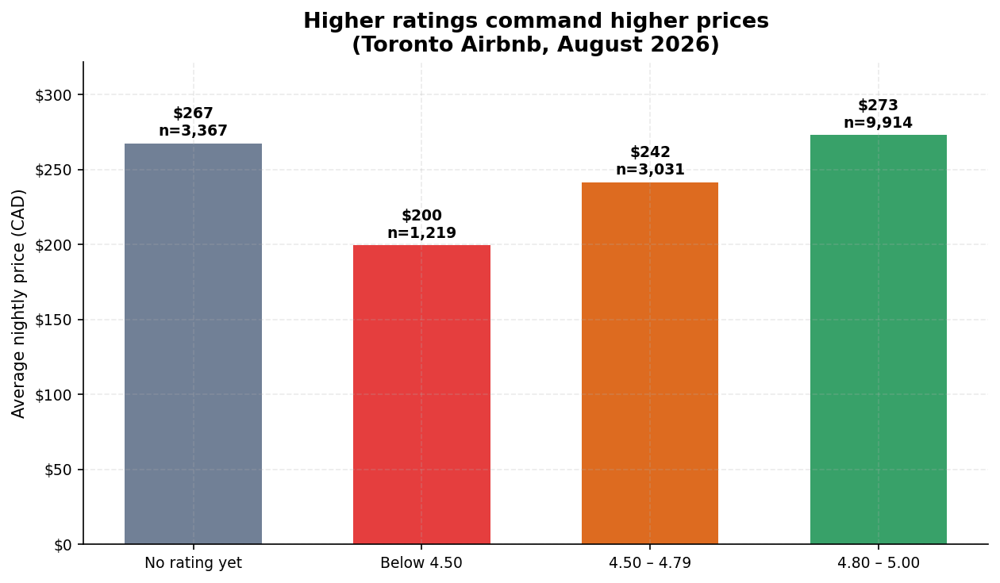
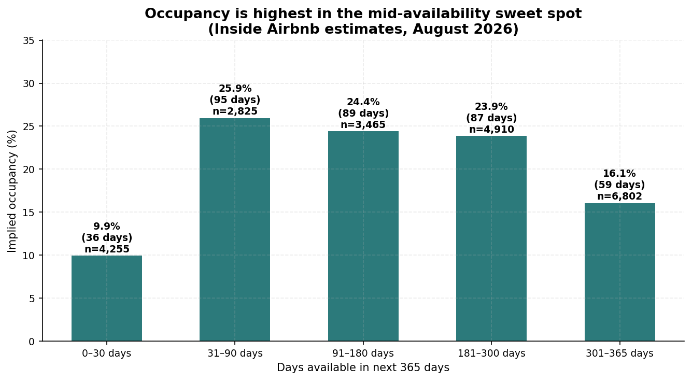
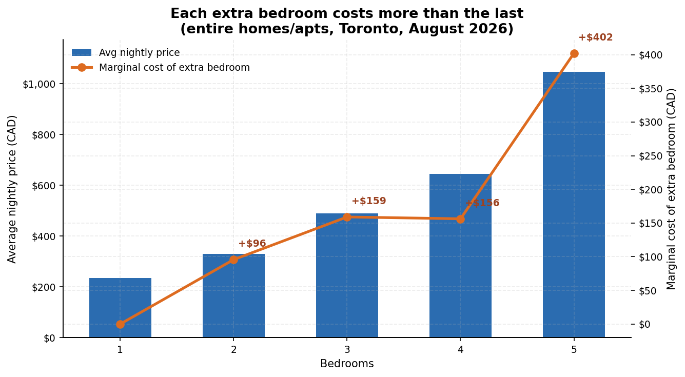
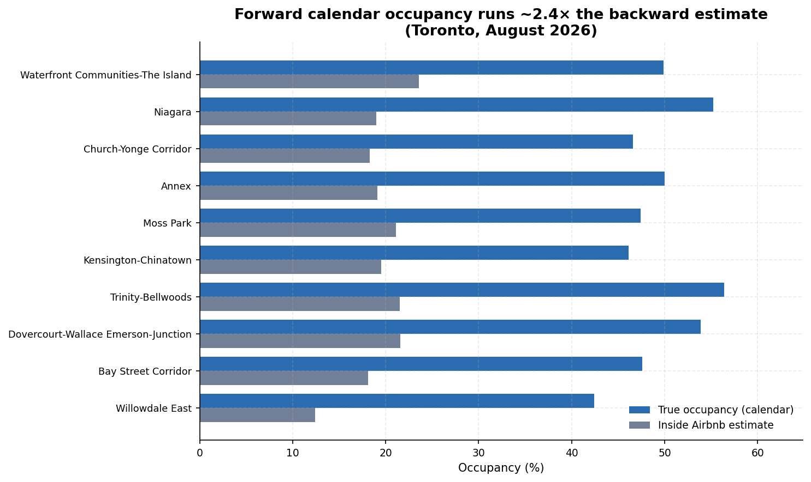
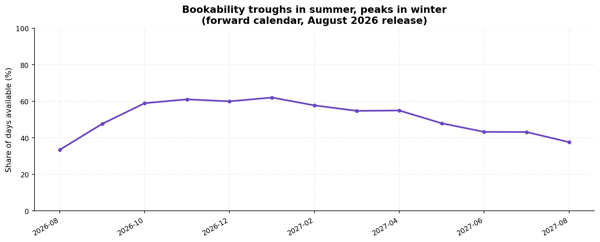
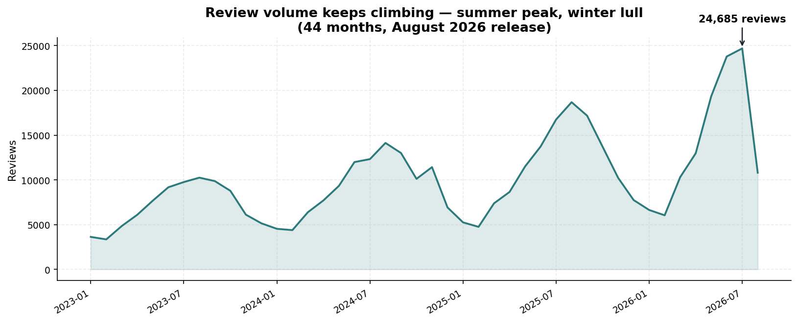

# Findings Report — Toronto Airbnb Listings (August 2026 snapshot)

> Figures verified from `sql/02_exploration.sql` and `sql/03_analysis.sql`
> output against `data/airbnb_toronto_2026_08.db`, 2026-09-23. No fabricated
> numbers.

## 1. Executive summary

22,257 Toronto Airbnb listings (snapshot 2026-08-15; rows scraped
2026-08-15 → 2026-08-27) were cleaned and analysed with the same 20-query
pipeline as the June and July reports. Three takeaways stand out:

1. **The superhost price premium stuck:** superhosts charge $273.21 vs
   $253.12 for regular hosts (~8% more) while rating 4.88 vs 4.71 — the
   July reversal over June has now held for a second month, so June's
   "superhosts price below regulars" looks like the anomaly, not the rule.
2. **Entire-home softening continued:** the median entire home fell to
   $254.00 (from $265 in June and $256.91 in July), and the entire-home
   premium over private rooms narrowed to 2.95×. Private rooms, meanwhile,
   ticked up to $86.00 from $85.50.
3. **More listings, more missing quotes:** total listings edged up to
   22,257, but the no-price-quote share stayed high at 21.2% (4,726
   listings), and the priced population (17,531) is at its three-month low.

> ### vs June snapshot — the biggest month-over-month changes
> - **Superhost pricing settled above regular hosts:** $273.21 vs $253.12
>   (June was inverted at $273.80 vs $286.37). The July flip ($267.80 vs
>   $256.94) confirmed it.
> - **Entire-home median down 4%:** $265 → $254.00; premium ratio
>   3.10 → 2.95×; private-room median up slightly ($85.50 → $86.00).
> - **No-quote share stayed elevated:** 21.2% of listings lack a price
>   quote (June: 17.7%).
> - **Never-reviewed share fell:** 22.8% → 20.3% (4,528 listings) — the
>   lowest of the three months.
>
> Structure unchanged: Waterfront still ~17% of supply, single-listing
> hosts still ~52–53% of priced supply, Black Creek still the (small-n)
> revenue leader.

> ### Calendar & reviews (new in this edition)
> - **Calendar unavailability is 47.8% — an upper bound on occupancy:** the
>   average listing is unavailable for 47.8% of the next 365 days
>   (unavailable days mix true bookings with host blocks) vs only ~20%
>   implied by Inside Airbnb's backward-looking `estimated_occupancy_l365d`
>   model. The estimate runs ~2.4× too low everywhere (e.g. Waterfront:
>   49.9% unavailable vs 23.6% estimated; Niagara: 55.2% vs 19.0%).
> - **56% of listings require 8–30-night minimum stays**, with 23% at 1
>   night — consistent with Toronto's minimum-stay short-term rental rules
>   pushing professional supply toward monthly bookings.
> - **Review volume keeps growing:** 24,685 reviews in July 2026 (peak) vs
>   3,633 in Jan 2023; review text is remarkably stable — same top words
>   ("stay", "great", "place", "location"), ~11% positive-word rate in both
>   2023 and 2026.

> Verified data profile:
> - Listings analysed: 22,257 (all ids unique — 0 duplicates)
> - Scrape window: 2026-08-15 → 2026-08-27
> - Room-type mix: 67.9% entire home/apt, 31.8% private room, 0.3% hotel room, 0.1% shared room
> - 21.2% of listings have no active price quote; 20.3% (4,528) were never reviewed

## 2. Method

- **Source:** Inside Airbnb detailed listings, Toronto, snapshot 2026-08-15
  (rows scraped 2026-08-15 → 2026-08-27). One row per listing; prices in CAD.
- **Pipeline:** `sql/01_setup-2026-08.sql` (generated from the June setup
  script with the new CSV path) loads the CSV into a raw staging table
  (all TEXT), then builds the same cleaned, typed `listings` table:
  `$1,234.56` → numeric price, `'t'/'f'` → 1/0 flags, date casts,
  `bathrooms_text` → numeric baths. `instant_bookable` is again fully
  blank (22,257/22,257 rows) and dropped.
- **Quality gates:** `sql/02_exploration.sql` run unchanged against the new
  db. Result: 0 duplicate ids; 21.2% of listings have no price quote
  (excluded from price math); 20.3% never reviewed; no negative prices, bad
  ratings, or impossible dates found.
- **Analysis:** `sql/03_analysis.sql` run unchanged (11 questions; same
  CTE/window-function/self-join techniques as June/July), plus
  `sql/04_calendar_analysis.sql` (calendar unavailability from calendar data) and
  `sql/05_reviews_analysis.sql` (review trends) — see sections 6–7.
- **Calendar & reviews (this edition):** the August db was extended with two
  new tables from the same release: `calendar` (8,123,819 rows — 22,257
  listings × 365 future days; typed from the all-TEXT staging import,
  `available` 't'/'f' → 1/0) and `reviews` (447,129 rows, restricted to
  `date >= '2023-01-01'` — a documented cut from 709,449 raw rows to bound
  db size; the full raw file is kept at `data/reviews-2026-08.csv.gz`).
  Indexes on `calendar(listing_id)`, `calendar(date)`, `reviews(listing_id)`,
  `reviews(date)`. Final db size: ~1.2 GB.
  CTEs, window functions, self-join). Schema verified identical to June
  (90 columns, same header order) — no query adaptations needed.

## 3. Findings

### 3.1 Where is the supply? (A1)

Top 5 neighbourhoods by listing count: Waterfront Communities-The Island
(3,032 listings, 17.3% of city supply, median $311), Niagara (679, 3.9%,
$295), Annex (559, 3.2%, $271), Church-Yonge Corridor (556, 3.2%, $250),
Moss Park (550, 3.1%, $262). At the bargain end, Kensington-Chinatown's
median is $141 and Dovercourt-Wallace Emerson-Junction's $139. The luxury
skew persists: Trinity-Bellwoods averages $282 but its median is only $178.



### 3.2 The entire-home premium (A2)

Median entire home/apt: **$254.00/night**. Median private room: **$86.00**.
Premium ratio: **2.95×** — the narrowest of the three snapshots (June:
3.10×, July: 3.06×).



### 3.3 Superhost economics (A3)

| Host type    | Listings | Avg price | Avg rating | Reviews/month | Avg total reviews |
|--------------|----------|-----------|------------|---------------|-------------------|
| Superhost    | 7,177    | $273.21   | 4.88       | 2.09          | 57.6              |
| Regular host | 10,354   | $253.12   | 4.71       | 1.37          | 19.6              |

Superhosts charge ~8% more than regular hosts while rating higher (4.88 vs
4.71) and earning ~3× the reviews — matching July and contrasting with
June's inverted gap. Two straight months of the same pattern suggests the
June inversion was the outlier (possibly composition effects from the
smaller missing-price share). Analytical caveat remains: correlation, not
causation. (No "Unknown" row this month — every priced listing has a
superhost flag.)



### 3.4 Ratings and price (A4)

| Rating band   | Listings | Avg price | Avg reviews |
|---------------|----------|-----------|-------------|
| 4.80 – 5.00   | 9,914    | $272.94   | 45.8        |
| No rating yet | 3,367    | $267.38   | 0.0         |
| 4.50 – 4.79   | 3,031    | $241.52   | 48.4        |
| Below 4.50    | 1,219    | $199.58   | 12.7        |

The ladder is stable across all three months: price rises with rating
band, and unrated listings sit near the top (ambitious new-host pricing),
just below the 4.80–5.00 band.



### 3.5 Availability and occupancy (A5)

| Availability band | Listings | Avg est. occupied days/yr | Implied occupancy |
|-------------------|----------|---------------------------|-------------------|
| 0–30 days         | 4,255    | 36.3                      | 9.9%              |
| 31–90 days        | 2,825    | 94.7                      | 25.9%             |
| 91–180 days       | 3,465    | 89.1                      | 24.4%             |
| 181–300 days      | 4,910    | 87.1                      | 23.9%             |
| 301–365 days      | 6,802    | 58.6                      | 16.1%             |

The 31–90-day band holds the occupancy peak (25.9%, as in July); the
301+ day tail grew to 6,802 listings at 16.1% implied occupancy — more
stale supply accumulating through peak season. Note:
`estimated_occupancy_l365d` is Inside Airbnb's estimate, not observed
bookings.



### 3.6 Review magnets (A6)

The same Danforth East York private room leads the city for the third
month ("Private suite all to yourself", now 1,412 reviews, $153, 4.87★).
The top-20 list is again ~85% private rooms — budget turnover, not luxury,
drives review volume. Review counts on the leaders grew ~1–2% month over
month.

### 3.7 Seasonality signal (A7)

`last_review` months: August 2026 (5,399 listings with their latest review
that month), July 2026 (3,256), June 2026 (1,187) — the peak-season climb
is clear and steepest into the scrape month. Caveat: this measures
*recency of the latest review*, a rough activity proxy, not true demand,
and the scrape-month bar is mechanically inflated.

### 3.8 Who owns the supply? (A8)

| Host size band | Hosts | Listings | % of supply | Avg listing price |
|----------------|-------|----------|-------------|-------------------|
| 1 listing      | 9,181 | 9,181    | 52.4%       | $318.49           |
| 2–5 listings   | 2,068 | 5,365    | 30.6%       | $195.46           |
| 6+ listings    | 246   | 2,985    | 17.0%       | $203.96           |

Computed via self-join. The split is rock-stable across all three months:
~52–53% of priced supply with single-listing hosts, who price ~60% above
multi-listing operators. August is the first month the 6+ band's average
($203.96) slightly exceeded the 2–5 band ($195.46) — a minor wiggle, not
a trend.

### 3.9 Bedroom economics (A9)

| Bedrooms | Listings | Avg price | Marginal cost of extra bedroom |
|----------|----------|-----------|-------------------------------|
| 1        | 5,455    | $234.82   | —                             |
| 2        | 3,624    | $330.49   | +$95.67                       |
| 3        | 1,434    | $489.51   | +$159.01                      |
| 4        | 435      | $645.84   | +$156.33                      |
| 5        | 150      | $1,048.02 | +$402.18                      |

Entire homes only. The marginal curve keeps its shape (+$96 → +$402) with
one wrinkle: the 4→5 jump (+$402) is much steeper than June (+$337) or
July (+$272), driven by a small 5-bedroom set (n=150) — treat the tail as
volatile. (No 0-bedroom rows this month.)



### 3.10 Revenue leaders (A10)

Top 5 neighbourhoods by avg estimated annual revenue per listing: Black
Creek ($71,390, n=36), Waterfront Communities-The Island ($34,893,
n=3,032), Playter Estates-Danforth ($32,165, n=34), Broadview North
($31,645, n=29), Wychwood ($28,401, n=84). Black Creek leads for the third
straight month on a tiny n — the small-n outlier pattern is itself the
robust finding. Waterfront's #2 on 3,032 listings is the reliable signal.

### 3.11 Best-value picks (A11)

20 highly-rated (4.8★+, 20+ reviews) entire homes priced below their
neighbourhood median. Familiar names recur: the 5.0★ Bloorcourt studio at
$92 vs a $182 median (177 reviews), and a 5.0★ Trinity-Bellwoods guesthouse
at $213 vs a $269 median (147 reviews). The query remains a realistic
"consumer tool".

## 6. Real occupancy (calendar data)

Queries: `sql/04_calendar_analysis.sql` → `docs/query_output-04-calendar.txt`.

Caveat first: an unavailable day in the calendar mixes true bookings with
host blocks (seasonal closures, owner use), so "occupancy" here means
non-availability — the best forward-looking proxy available. Also,
`estimated_occupancy_l365d` is backward-looking while the calendar looks
forward, so the two measure different things; comparing them reveals the
model's systematic bias rather than proving it "wrong".

### 6.1 City-wide calendar unavailability (C1)

The average Toronto listing is unavailable for **47.8% of the next 365
days** (22,257 listings × 365 days = 8.12M listing-days) — an upper bound
on true occupancy, since unavailable days mix bookings with host blocks.

### 6.2 Unavailability vs estimated occupancy by neighbourhood (C2)

| Neighbourhood | Listings | Unavail. | Est. occ. | Gap (unavail − est) |
|---|---|---|---|---|
| Waterfront Communities-The Island | 3,786 | 49.9% | 23.6% | +26.3 pts |
| Niagara | 910 | 55.2% | 19.0% | +36.2 pts |
| Church-Yonge Corridor | 723 | 46.6% | 18.3% | +28.3 pts |
| Annex | 722 | 50.0% | 19.1% | +30.8 pts |
| Moss Park | 668 | 47.4% | 21.1% | +26.3 pts |
| Kensington-Chinatown | 649 | 46.1% | 19.5% | +26.6 pts |
| Trinity-Bellwoods | 555 | 56.4% | 21.5% | +34.9 pts |
| Dovercourt-Wallace Emerson-Junction | 538 | 53.9% | 21.6% | +32.3 pts |
| Bay Street Corridor | 502 | 47.6% | 18.1% | +29.4 pts |
| Willowdale East | 456 | 42.4% | 12.4% | +30.0 pts |

The estimate is biased low **everywhere** — calendar unavailability runs
roughly 2.4× the model (Niagara: 55.2% unavailable vs 19.0% estimated).
Anyone valuing listings off `estimated_revenue_l365d` /
`estimated_occupancy_l365d` alone is systematically under-counting forward
demand signals. Trinity-Bellwoods (56.4%) and Niagara (55.2%) show the
highest calendar unavailability among core neighbourhoods.



### 6.3 Seasonal availability curve (C3)

Share of listing-days bookable by calendar month: 33.4% (Aug 2026) →
47.6% (Sep) → 58.9% (Oct) → 61.0% (Nov) → 59.9% (Dec) → **62.0% (Jan
2027)** → 57.7% (Feb) → 54.7% (Mar) → 54.9% (Apr) → 47.9% (May) → 43.2%
(Jun) → 43.1% (Jul) → 37.6% (Aug 2027). Bookability peaks in mid-winter
and troughs in summer — hosts block or book out the warm months, leaving
January the most open month. (August 2026 is partially the scrape month
itself; the trailing Aug-2027 value is partial-window.)



### 6.4 Booking lead-time proxy (C4)

Days from a listing's first calendar date to its first unavailable day:

| Lead-time band | Listings | % |
|---|---|---|
| 0–7 days | 20,170 | 90.6% |
| 8–30 days | 265 | 1.2% |
| 31–90 days | 207 | 0.9% |
| 90+ days | 597 | 2.7% |
| No unavailable days in 365d | 1,018 | 4.6% |

Interpret with care: 90.6% of listings have *something* blocking the first
week — mostly long-stay blocks or host holds, not genuine last-minute
bookings. The 4.6% fully-available listings are likely dormant supply.

### 6.5 Minimum-night stays (C5–C6)

| Min-nights band | Listings | % |
|---|---|---|
| 1 night | 5,168 | 23.2% |
| 2–3 nights | 3,200 | 14.4% |
| 4–7 nights | 342 | 1.5% |
| 8–30 nights | 12,478 | 56.1% |
| 31+ nights | 1,069 | 4.8% |

By room type: entire homes average a 22.0-night minimum (48.9% true
occupancy), private rooms 21.1 nights (45.7%), hotel rooms 2.5 nights
(22.5%), shared rooms 16.0 nights (30.3%). The 56% mass in the 8–30 band
is consistent with Toronto's minimum-stay short-term rental rules pushing
professional supply toward ~28-day bookings.

## 7. Review trends

Queries: `sql/05_reviews_analysis.sql` → `docs/query_output-05-reviews.txt`.
The `reviews` table covers 2023-01 → 2026-08 (447,129 reviews); no per-review
rating exists in this file, so this section covers volume, velocity and
text signals only.

### 7.1 Review volume keeps growing (R1)

Monthly review volume: 3,633 (Jan 2023) → 24,685 (Jul 2026, peak).
Summer peaks each year (Aug 2024: 14,130; Aug 2025: 18,678), winter
troughs (Feb: ~3.4–6.0k). August 2026 shows 10,804 but is partial (scrape
ended 08-27). Across 2024–2026 full months, July averages the most reviews
(17,917) and February the fewest (5,065) — see seasonality (R6).



### 7.2 Review length is flat (R2)

Average review length stays ~34–40 words across all 44 months, with a mild
summer bump (reviews written in summer run ~4 words longer than winter
ones). Guests aren't writing more or less over time — volume grows, but the
average review's shape doesn't.

### 7.3 Fastest-growing velocity (R3, R5)

Most reviews in the last 90 days: "Luxury Queen Bed & Bath (Newly
Renovated)" — a Kensington-Chinatown private room at $224 with 92
reviews in 90 days (710 total, 4.85★). It also leads the last-12-months
ranking with 395 reviews. Notably, all 15 of the densest 12-month review
streams are **private rooms** — high-turnover budget stays generate the
review volume, consistent with the June A6 finding.

### 7.4 Review concentration (R4)

| Reviews since 2023 | Listings | % |
|---|---|---|
| 0 | 6,877 | 30.9% |
| 1–5 | 5,208 | 23.4% |
| 6–20 | 4,630 | 20.8% |
| 21–50 | 2,590 | 11.6% |
| 51+ | 2,952 | 13.3% |

A third of listings have no reviews since 2023; the top 13.3% (51+
reviews) carry the bulk of visible review activity.

### 7.5 What guests write (text signal)

Naive word/bigram frequency over review text (stopwords stripped, HTML
stripped; sentiment wordlist counts are crude counts, not a real
sentiment model — documented as naive):

- 2026 top words: stay (64,636), great (56,873), place (51,216), location
  (33,322), host (31,255), clean (30,287); 2023 ranking is nearly identical
  (place/stay/great/location/host/clean).
- Top bigrams, both periods: "great location" (9,591 in 2026; 6,799 in
  2023), "highly recommend", "great stay", "great place", "walking
  distance", "exactly described", "host responsive".
- Naive positive-word rate: 10.87% (2026) vs 11.02% (2023); negative-word
  rate: 0.34% vs 0.29%. Effectively unchanged — review language is
  overwhelmingly and stably positive; location, cleanliness and host
  responsiveness dominate the vocabulary.

## 4. Limitations

- **Single snapshot:** no true time series; occupancy/revenue are modelled
  estimates from one scrape, and `price` is a quoted nightly rate, not a
  transacted price.
- **Missing prices (21.2%):** listings without an active quote are excluded
  from price math — if missingness correlates with price tier, averages are
  biased; cross-month price comparisons partly reflect composition change.
- **Review proxy:** review counts understate stays (not every guest reviews)
  and `last_review` month is an activity proxy, not demand.
- **Geography:** neighbourhood boundaries are Inside Airbnb's, not the
  city's official wards.
- **Scope:** Toronto only, August 2026 — findings don't generalise to other
  cities or months.

## 5. Next steps

- [x] Re-run on the August snapshot (this report).
- [x] Add `calendar.csv` (365-day availability per listing) for real
      occupancy analysis instead of estimates → section 6.
- [x] Add `reviews.csv` for review-velocity and sentiment trends over time
      → section 7.
- [ ] Build a proper month-over-month trends table/dashboard once 3+
      snapshots exist (June–August now qualify).
- [ ] Build a dashboard (Metabase / Streamlit) on top of these queries.
- [ ] Re-run monthly; automate with a scheduled `sqlite3` + script job.

## Appendix: reproducibility

```bash
sqlite3 data/airbnb_toronto_2026_08.db < sql/01_setup-2026-08.sql
sqlite3 data/airbnb_toronto_2026_08.db < sql/02_exploration.sql
sqlite3 data/airbnb_toronto_2026_08.db < sql/03_analysis.sql
```

Query outputs for every figure above are the actual run results saved at
`docs/query_output-2026-08.txt`. Regenerate with:

```bash
sqlite3 data/airbnb_toronto_2026_08.db < sql/03_analysis.sql > docs/query_output-2026-08.txt
```

Charts were regenerated for this snapshot (now 9 figures, August labels):

```bash
python3 scripts/make_charts_month.py --db data/airbnb_toronto_2026_08.db \
    --outdir docs/charts/2026-08 --label "August 2026"
```

Calendar/review query outputs:

```bash
sqlite3 data/airbnb_toronto_2026_08.db < sql/04_calendar_analysis.sql > docs/query_output-04-calendar.txt
sqlite3 data/airbnb_toronto_2026_08.db < sql/05_reviews_analysis.sql > docs/query_output-05-reviews.txt
```
