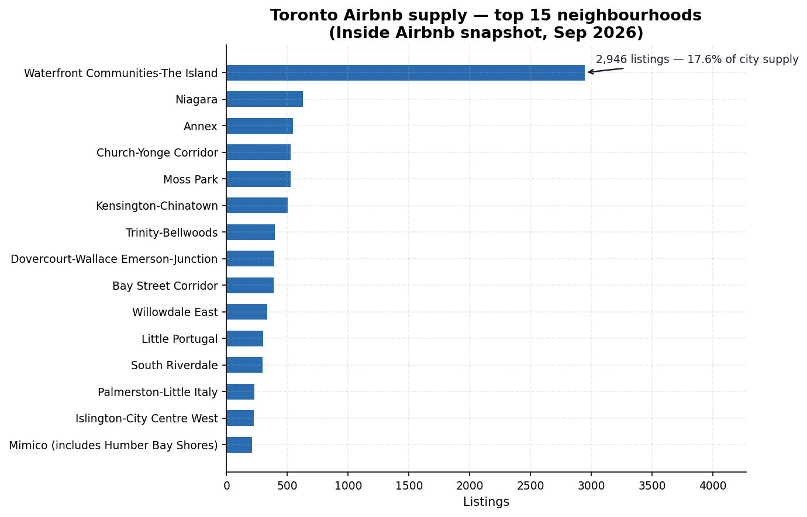
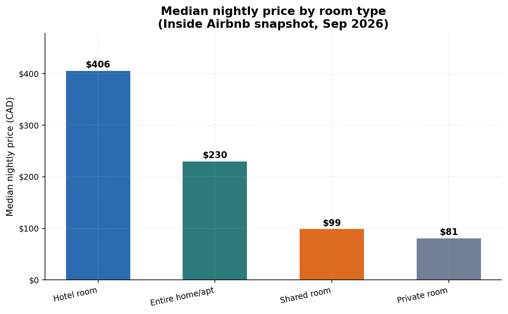
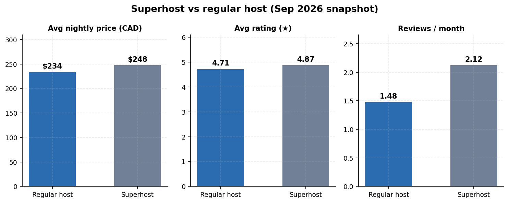
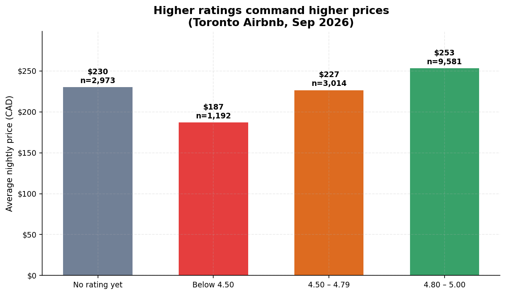
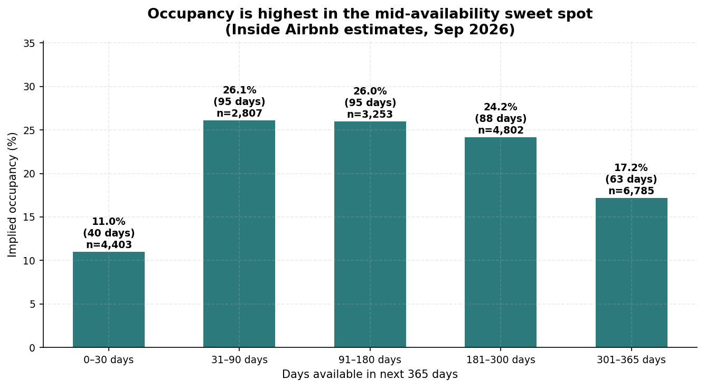
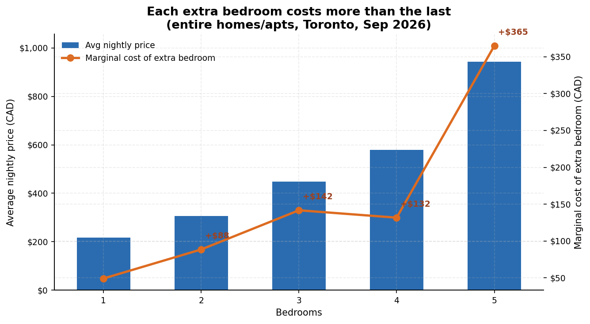

# Findings Report — Toronto Airbnb Listings (September 2026 snapshot)

> Figures verified from `sql/02_exploration.sql` and `sql/03_analysis.sql`
> output against `data/airbnb_toronto_2026_09.db`, 2026-09-23. No fabricated
> numbers.

## 1. Executive summary

22,050 Toronto Airbnb listings (snapshot 2026-09-16; rows scraped
2026-09-17 → 2026-09-18) were cleaned and analysed with the same 20-query
pipeline as the June, July and August reports. Three takeaways stand out:

1. **Entire-home softening accelerated:** the median entire home fell to
   **$230.00** (August: $254.00, July: $256.91, June: $265.00) — three
   straight monthly declines, this one 9.4%. Private rooms fell too
   ($86.00 → $81.00), so the entire-home premium narrowed to 2.84×, the
   tightest of the four snapshots.
2. **Missing prices hit a new high:** 24.0% of listings (5,290) have no
   active price quote, up from 21.2% in August and 17.7% in June. The
   priced population (16,760) is at a four-month low — cross-month price
   comparisons increasingly reflect composition change, not just pricing.
3. **Superhost premium confirmed as the new normal:** superhosts charge
   $247.73 vs $233.76 for regular hosts (~6% more), rating 4.87 vs 4.71.
   Three consecutive months above regulars (July, August, September) now
   settle the June inversion as the outlier.

> ### vs August snapshot — the biggest month-over-month changes
> - **Entire-home median down 9.4%:** $254.00 → $230.00 (June was $265.00);
>   private-room median $86.00 → $81.00; premium ratio 2.95 → 2.84×.
> - **No-quote share jumped again:** 21.2% → 24.0% (5,290 listings) — the
>   largest missing-price share of any snapshot; priced listings at a
>   four-month low of 16,760.
> - **Superhost pattern held:** $247.73 vs $233.76 (~6% premium), third
>   month running since the July flip.
> - **Occupancy peak shifted:** the 31–90-day availability band now leads
>   implied occupancy (26.1%); the 301+ day stale tail grew to 6,785
>   listings at 17.2% implied occupancy.
> - **Bedroom curve bent:** 0-bedroom listings appeared in force (n=633,
>   avg $168); the 3→4 marginal step actually shrank (+$132 vs +$142 at
>   2→3) before the 4→5 step surged to +$365.
>
> Otherwise the market structure is unchanged: Waterfront ~17–18% of
> supply, single-listing hosts ~53% of priced supply, Black Creek still
> the (small-n) revenue leader, review volume still driven by private
> rooms.

> ### vs June snapshot (four months of data)
> - Entire-home median $265.00 → $230.00 (−13.2%); private rooms
>   $85.50 → $81.00 (−5.3%); premium 3.10 → 2.84×.
> - No-quote share 17.7% → 24.0% (+6.3 pp).
> - Never-reviewed share 22.8% → 19.4% (4,286) — the lowest yet.
> - Total listings essentially flat: 22,198 → 22,050 (−0.7%).

> Verified data profile:
> - Listings analysed: 22,050 (all ids unique — 0 duplicates)
> - Scrape window: 2026-09-17 → 2026-09-18
> - Room-type mix: 67.9% entire home/apt, 31.7% private room, 0.3% hotel room, 0.1% shared room
> - 24.0% of listings have no active price quote; 19.4% (4,286) were never reviewed

## 2. Method

- **Source:** Inside Airbnb detailed listings, Toronto, snapshot 2026-09-16
  (rows scraped 2026-09-17 → 2026-09-18). One row per listing; prices in CAD.
- **Pipeline:** `sql/01_setup-2026-09.sql` (generated from the August setup
  script with the new CSV path) loads the CSV into a raw staging table
  (all TEXT), then builds the same cleaned, typed `listings` table:
  `$1,234.56` → numeric price, `'t'/'f'` → 1/0 flags, date casts,
  `bathrooms_text` → numeric baths. `instant_bookable` is again fully
  blank (22,050/22,050 rows) and dropped.
- **Quality gates:** `sql/02_exploration.sql` run unchanged against the new
  db. Result: 0 duplicate ids; 24.0% of listings have no price quote
  (excluded from price math); 19.4% never reviewed; no negative prices, bad
  ratings, or impossible dates found.
- **Analysis:** `sql/03_analysis.sql` run unchanged (11 questions; same
  CTEs, window functions, self-join). Schema verified identical to August
  (90 columns, same header order, diffed before loading) — no query
  adaptations needed.

## 3. Findings

### 3.1 Where is the supply? (A1)

Top 5 neighbourhoods by listing count: Waterfront Communities-The Island
(2,946 listings, 17.6% of city supply, median $291), Niagara (630, 3.8%,
$283), Annex (548, 3.3%, $249), Church-Yonge Corridor (529, 3.2%, $245),
Moss Park (528, 3.2%, $265). The cheapest medians: Kensington-Chinatown
($116) and Islington-City Centre West ($129). The luxury skew persists:
Trinity-Bellwoods averages $263 but its median is only $168 — same
pattern as the last three months.



### 3.2 The entire-home premium (A2)

Median entire home/apt: **$230.00/night**. Median private room: **$81.00**.
Premium ratio: **2.84×** — the narrowest of the four snapshots (June:
3.10×, July: 3.06×, August: 2.95×). Both room types are cheaper than in
June (−13% entire homes, −5% private rooms), so the narrowing reflects
entire-home softness, not room strength.



### 3.3 Superhost economics (A3)

| Host type    | Listings | Avg price | Avg rating | Reviews/month | Avg total reviews |
|--------------|----------|-----------|------------|---------------|-------------------|
| Superhost    | 6,925    | $247.73   | 4.87       | 2.12          | 60.6              |
| Regular host | 9,835    | $233.76   | 4.71       | 1.48          | 20.1              |

Superhosts charge ~6% more than regular hosts while rating 4.87 vs 4.71
and earning ~3× the reviews — the third straight month of the pattern
since the July flip. June's inverted gap is now firmly the outlier.
Analytical caveat remains: correlation, not causation. (No "Unknown" row —
every priced listing has a superhost flag.)



### 3.4 Ratings and price (A4)

| Rating band   | Listings | Avg price | Avg reviews |
|---------------|----------|-----------|-------------|
| 4.80 – 5.00   | 9,581    | $253.09   | 47.6        |
| No rating yet | 2,973    | $230.11   | 0.0         |
| 4.50 – 4.79   | 3,014    | $226.52   | 48.5        |
| Below 4.50    | 1,192    | $187.00   | 12.7        |

The rating ladder is identical in shape to the last three months — price
rises with band, unrated listings sit just below the top band — but every
band is cheaper than in August (top band $272.94 → $253.09). The whole
market is softening, not just one segment.



### 3.5 Availability and occupancy (A5)

| Availability band | Listings | Avg est. occupied days/yr | Implied occupancy |
|-------------------|----------|---------------------------|-------------------|
| 0–30 days         | 4,403    | 40.2                      | 11.0%             |
| 31–90 days        | 2,807    | 95.3                      | 26.1%             |
| 91–180 days       | 3,253    | 94.8                      | 26.0%             |
| 181–300 days      | 4,802    | 88.2                      | 24.2%             |
| 301–365 days      | 6,785    | 62.7                      | 17.2%             |

The 31–90-day band edges out the 91–180-day band for the occupancy peak
(26.1% vs 26.0%) — a small shift from July/August, when 91–180 led. The
301+ day tail is flat in size (6,785 vs 6,802 in August) at 17.2% implied
occupancy. Note: `estimated_occupancy_l365d` is Inside Airbnb's estimate,
not observed bookings.



### 3.6 Review magnets (A6)

The same Danforth East York private room leads the city for the fourth
month ("Private suite all to yourself", now 1,424 reviews, $138, 4.87★).
18 of the top 20 are private rooms — budget turnover, not luxury, keeps
driving review volume. Review counts on the leaders grew ~1% over August.

### 3.7 Seasonality signal (A7)

`last_review` months: September 2026 (5,105 listings with their latest
review that month), August 2026 (4,159), July 2026 (897) — the summer peak
is cresting and trailing off into September, matching the seasonal
pattern. Older months fall to ~200/month through fall 2025 and
~50–150/month in early 2024. Caveat: this measures *recency of the latest
review*, a rough activity proxy, not true demand, and the scrape-month
bar is mechanically inflated.

### 3.8 Who owns the supply? (A8)

| Host size band | Hosts | Listings | % of supply | Avg listing price |
|----------------|-------|----------|-------------|-------------------|
| 1 listing      | 8,879 | 8,879    | 53.0%       | $293.69           |
| 2–5 listings   | 1,998 | 5,215    | 31.1%       | $181.98           |
| 6+ listings    | 220   | 2,666    | 15.9%       | $171.75           |

Computed via self-join. Rock-stable for the fourth month: ~53% of priced
supply with single-listing hosts, who price ~61% above multi-listing
operators. The 6+ band's average ($171.75) is again the lowest — the
August wiggle where it exceeded the 2–5 band did not repeat.

### 3.9 Bedroom economics (A9)

| Bedrooms | Listings | Avg price | Marginal cost of extra bedroom |
|----------|----------|-----------|-------------------------------|
| 0        | 633      | $168.00   | —                             |
| 1        | 5,223    | $217.10   | +$49.10 (vs 0-bd)             |
| 2        | 3,514    | $305.59   | +$88.49                       |
| 3        | 1,339    | $447.25   | +$141.65                      |
| 4        | 413      | $578.88   | +$131.64                      |
| 5        | 140      | $943.83   | +$364.95                      |

Entire homes only. Two firsts: 0-bedroom listings appear in force (n=633,
avg $168 — studio-style stock newly classified), and the marginal curve
bends — the 3→4 step (+$132) is smaller than the 2→3 step (+$142),
breaking the "each bedroom costs more than the last" pattern seen in
June–August. The 4→5 step surged to +$365 on a thin n=140 — treat the
tail as volatile.



### 3.10 Revenue leaders (A10)

Top 5 neighbourhoods by avg estimated annual revenue per listing: Black
Creek ($63,997, n=34), Waterfront Communities-The Island ($34,878,
n=2,946), Broadview North ($29,846, n=30), Playter Estates-Danforth
($28,537, n=34), Niagara ($28,184, n=630). Black Creek leads for the
fourth straight month on a tiny n (down from August's $71,390) — the
small-n outlier pattern is itself the robust finding. Waterfront's #2 on
2,946 listings is the reliable signal.

### 3.11 Best-value picks (A11)

20 highly-rated (4.8★+, 20+ reviews) entire homes priced below their
neighbourhood median. Familiar names recur for the fourth month: the 5.0★
Bloorcourt studio at $86.14 vs a $174.91 median (178 reviews), and the
5.0★ "Garden studio at Bloor West" at $73.22 vs a $186.22 Lambton median
(58 reviews). The query remains a realistic "consumer tool".

## 4. Limitations

- **Single snapshot:** no true time series; occupancy/revenue are modelled
  estimates from one scrape, and `price` is a quoted nightly rate, not a
  transacted price.
- **Missing prices (24.0%):** listings without an active quote are excluded
  from price math — the largest missing share of any snapshot, so
  cross-month price comparisons increasingly reflect composition change as
  well as pricing.
- **Review proxy:** review counts understate stays (not every guest reviews)
  and `last_review` month is an activity proxy, not demand.
- **Geography:** neighbourhood boundaries are Inside Airbnb's, not the
  city's official wards.
- **Scope:** Toronto only, September 2026 — findings don't generalise to
  other cities or months.

## 5. Next steps

- [x] Re-run on the September snapshot (this report).
- [ ] Add `calendar.csv` (365-day availability per listing) for real
      occupancy analysis instead of estimates.
- [ ] Add `reviews.csv` for review-velocity and sentiment trends over time.
- [ ] Build a proper month-over-month trends table/dashboard — four
      snapshots (June–September) now qualify.
- [ ] Build a dashboard (Metabase / Streamlit) on top of these queries.
- [ ] Re-run monthly; automate with a scheduled `sqlite3` + script job.

## Appendix: reproducibility

```bash
sqlite3 data/airbnb_toronto_2026_09.db < sql/01_setup-2026-09.sql
sqlite3 data/airbnb_toronto_2026_09.db < sql/02_exploration.sql
sqlite3 data/airbnb_toronto_2026_09.db < sql/03_analysis.sql
```

Query outputs for every figure above are the actual run results saved at
`docs/query_output-2026-09.txt`. Regenerate with:

```bash
sqlite3 data/airbnb_toronto_2026_09.db < sql/03_analysis.sql > docs/query_output-2026-09.txt
```

Charts were regenerated for this snapshot (same 6 figures, September labels):

```bash
python3 scripts/make_charts_month.py --db data/airbnb_toronto_2026_09.db \
    --outdir docs/charts/2026-09 --label "September 2026"
```
